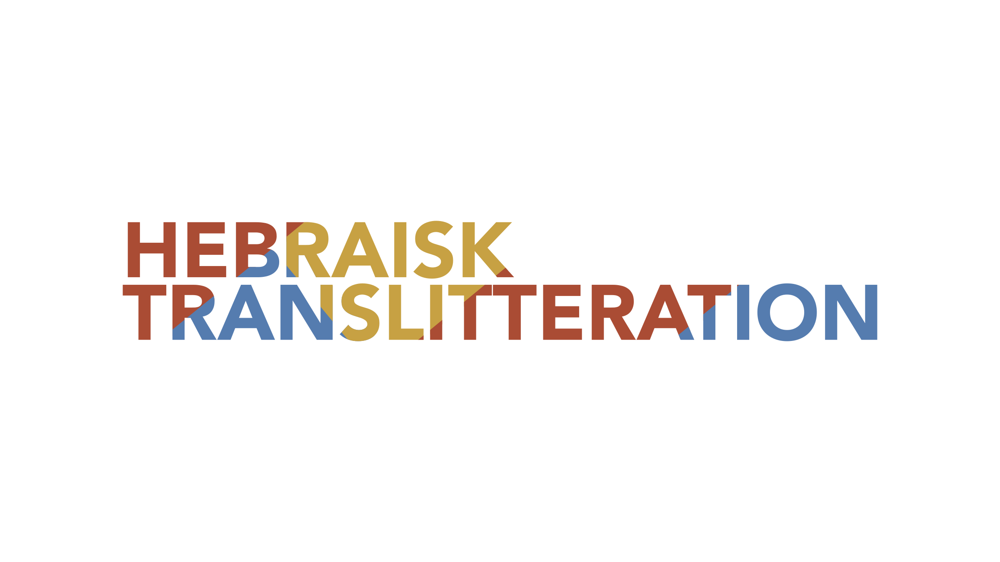

# Hebraisk Translitteration

A tool for transliterating liturgical Hebrew texts to Danish orthography.
It is an augmentation of [havarot](https://github.com/charlesLoder/havarot).

## About

Its purpose is to transliterate litrugical Hebrew into Danish orthography.

Funding for this module was graciously provided by [Educating for Impact](https://educatingforimpact.com/).

## Install

### npm

`npm install github:taatik/hebraisk-translitteration`

### source

Download or clone this repository.

```bash
cd hebraisk-translitteration
npm install
npm run build
```

## Example

### JavaScript

```javascript
const hebrewTransliteration = require("hebraisk-translitteration");
const Text = hebrewTransliteration.Text;
const heb = new Text("שָׁלֹום");
const transliteration = heb.transliterate();
transliteration;
// shalom
```

### TypeScript

```typescript
import { Text } from "hebraisk-translitteration";
const heb = new Text("שָׁלֹום");
const transliteration = heb.transliterate();
transliteration;
// shalom
```

## Schema

### Consonants

For consonants with slashes, the left hand side reprsents the unmarked (i.e. spirantized) form, and the right side is the marked form.

| Consonant | Transliteration | Consonant | Transliteration |
| :-------: | :-------------: | :-------: | :-------------: |
|     א     |                 |    מ ם    |        m        |
|     ב     |       b/v       |    נ ן    |        n        |
|     ג     |        g        |     ס     |        s        |
|     ד     |        d        |     ע     |                 |
|     ה     |        h        |    פ ף    |       p/f       |
|     ו     |        v        |    צ ץ    |       tz        |
|     ז     |        z        |     ק     |        k        |
|     ח     |       ch        |     ר     |        r        |
|     ט     |        t        |    שׂ     |        s        |
|     י     |        j        |    שׁ     |       sh        |
|    כ ך    |      k/ch       |     ת     |        t        |
|     ל     |        l        |           |                 |

### Vowels

|        Vowel        | Transliteration |      Vowel       | Transliteration |
| :-----------------: | :-------------: | :--------------: | :-------------: |
|      ◌ַ patakh      |        a        |  י◌ִ hireq yod   |        i        |
|  ◌ַ furtive patakh  |        a        | ◌ָ qamets katan  |        å        |
|      ◌ָ qamets      |        a        |     ◌ֹ holem     |        å        |
| ה◌ָ final qamets he |        a        |  וֹ full holem   |        å        |
| יו◌ָ three 3ms sufx |       av        | ◌ֻ short qibbuts |        u        |
|      ◌ֶ segol       |        æ        | ◌ֻ long qibbuts  |        u        |
|      ◌ֵ tsere       |        æ        |    וּ shureq     |        u        |
|    י◌ֵ tsere yod    |       æj        | ◌ֳ khatef qamets |        a        |
|    י◌ֶ segol yod    |       æj        | ◌ֲ khatef patakh |        a        |
|   ◌ִ short hiriq    |        i        | ◌ֱ khatef segol  |        æ        |
|    ◌ִ long hiriq    |        i        |  ◌ְ vocal shewa  |       æe        |

## Contributors

- Charlotte Lang
- Jair Melchior
- Karen Lisa Salamon
- Maja Sasson
